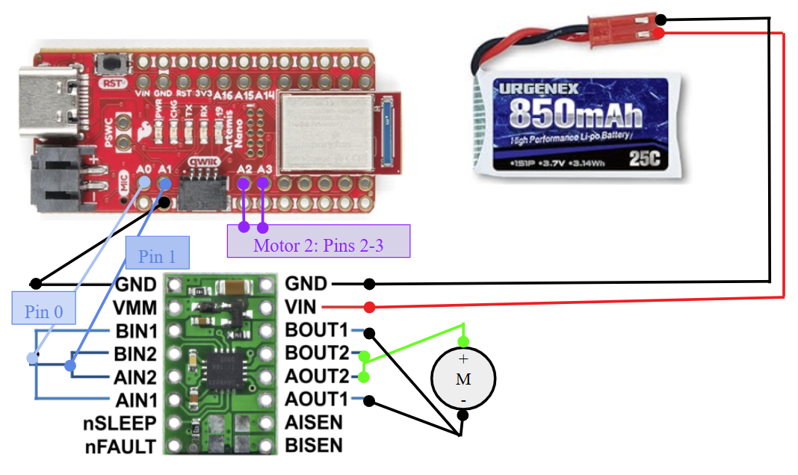

# Lab 4: Motor Drivers and Open-Loop Control (Due 3/4/2025)

## Prelab
* The diagram below depicts how I plan to wire and solder the two motor drivers. (For clarity, only one motor driver is actually shown, but the other is connected identically with the exceptions that Ain1 and Bin1 are connected to Pin 2 and Ain2 and Bin2 are connected to Pin 3.)

* It is best to power the Artemis and the motor drivers/motors from separate batteries because it protects the microcontroller from back-EMF effects, especially when we parallel-couple the two inputs and outputs on each dual motor driver to deliver twice the average current.  

## Lab Tasks
* In the lab, I connected the power supply to the Vin and GND pins of the motor driver, Channel 1 of the oscilloscope to Ain1 and Bin1 (also connected to pin 0 of the Artemis), Channel 2 of the oscilliscope to Ain2 and Bin2 (also connected to pin 1 of the Artemis), and the final GND pin to the GND pin adjacent to thee QWIIC connector. 
* Because the operating voltage of the motor drivers is 2.7 - 10.8 V (according to the datasheet) and the Artemis generally operates between 3.3 - 5 V (according to its data), a reasonable setting to start the power supply at would be 3.3 V, which is what I set it to in the lab. The 850 mAh battery notes that the battery supplies 3.7 V, which would be a reasonable maximum supply. 
* The code to test the motor drivers was very simple, and was largely derived from Mikayla Lahr's example. 
```
void setup() {
   pinMode(0, OUTPUT); //A/Bin1
   pinMode(1, OUTPUT); //A/Bin2
}

void loop() {
   analogWrite(0, 255);
   analogWrite(1, 0);
   delay(1000);
   analogWrite(0, 0);
   analogWrite(1, 255);
   delay(1000);
}
```
* Image of your oscilloscope
* Short video of wheels spinning as expected (including code snippet it’s running on)
* Short video of both wheels spinning (with battery driving the motor drivers)
* The picture below shows the motor drivers soldered into the vehicle.

* Explore the lower limit in PWM value for which the robot moves forward and on-axis turns while on the ground; note it may require slightly more power to start from rest compared to when it is running.
* While I did not encounter the issue where my motors turned at different speeds when given the same output, I also observed that my car ran very slowly. This was unusual, but as I attempt to fix the problem, I have also dedicated some thought to my methods should I encounter this issue. I would likely choose to adjust the motor that runs faster than the other to have a slightly reduced input speed so that I could use the robot for longer (as lower torque would hopefully use less power).
* Open loop code and video
