# Lab 1 (Due 2/4/2025)

## 1. Prelab
* Setup: To set up my laptop for Lab 1, I updated the ArduinoIDE, python, pip, and Ruby/Jekyll, installed the Sparkfun Apollo3 Boards Manager along with its BLE functionality in ArduinoBLE, downloaded the provided BLE codebase, configured a Python virtual environment for the class with the necessary Python packages, and started the necessary Jupyter server.
* Codebase: The provided BLE (Bluetooth Low Energy) codebase allows wireless communication between my laptop and the RedBoard Artemis Nano. After establishing a Bluetooth connection to the Artemis, the functions in the Jupyter Notebook titled 'demo.ipynb' allow us to interface with the program that the Artemis runs. The Artemis runs 'ble_arduino.ino', which contains the RobotCommand class used to parse and execute incoming commands from my laptop via the established BLE wireless connection.

## 2. Lab Tasks
* Configurations: The most relevant configurations in Lab 1 were the updated MAC Address and UUID for connecting to the Artemis, which I have copied below.
      **MAC Address:** C0:81:48:26:03:64 \
      **UUID:** e2402ec7-6475-4e44-8a84-14f5f0a2714a

### Lab 1A: Running Examples
(Links can be clicked while embedded elements are being fixed.)
* **Blink** [(Video)](https://drive.google.com/file/d/1xIzqJUezocPGHhrTWb7VjePoeF5r74GS/view?usp=drive_link)
In this task, I ran the Blink example program available for the board in the Arduino IDE after installing the appropriate boards manager to blink the on-board LED once per second (ie. LED on for one second, then off for the next, on for the next, and so on and so forth).

* **Serial** (Image)
In this task, I ran the Serial example program from the Arduino IDE, which echoes input into the Serial Monitor (set to a baud rate of 115200), as shown in the image below. 
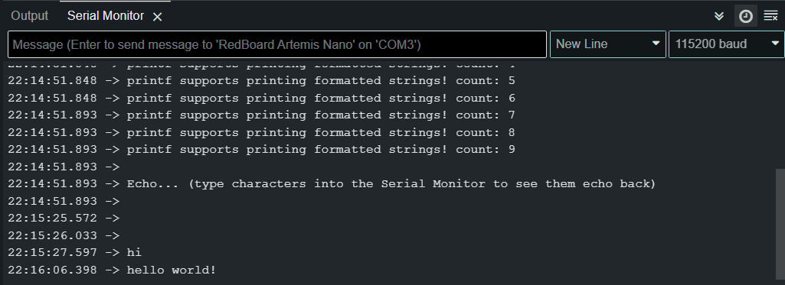

* **Temperature Sensor** [(Video)](https://drive.google.com/file/d/1gojz9QNEUzZ2iIfegu5upLsX2VUIe07e/view?usp=drive_link)
In this task, I ran the analogRead example program to test the on-board temperature sensor. This program outputs the value reported by the temperature sensor to the Serial Monitor. 

     
* **Microphone Output** [(Video)](https://drive.google.com/file/d/1HumIYP9cOY7PDWdwWlvY7f89ZkB_L09U/view?usp=sharing)
In this task, I ran the Microphone Output example program to test the on-board microphone. This program outputs the loudest frequency observed to the Serial Monitor.

### Lab 1B: Ensuring Communication Ability w/RedBoard Artemis Nano
* **Echo Command**
In this task, I used the provided ECHO command in the ble_arduino.ino sketch to echo a phrase from the RedBoard Artemis Nano over the established Bluetooth connection.  
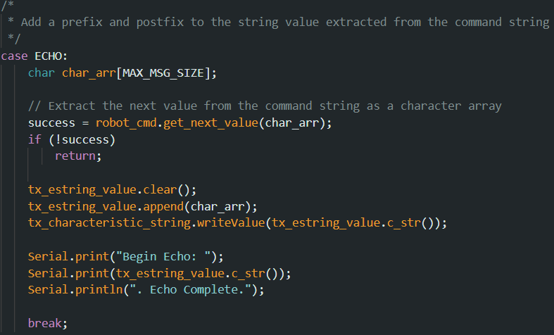
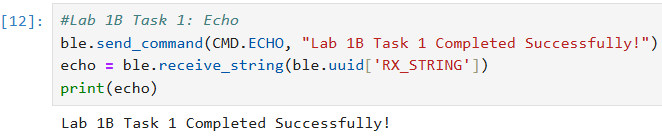

* **Send Three Floats Command**
In this task, I used the provided SEND_THREE_FLOATS command in the ble_arduino.ino sketch to send three floats to the board and extracted them in the same Arduino sketch.  
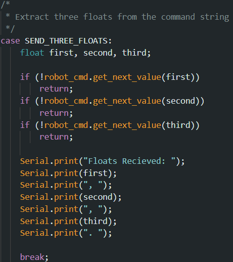
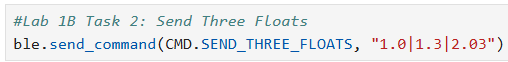
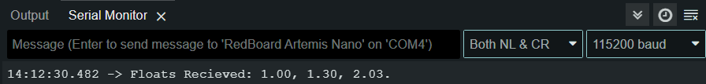

* **Get Time Command**
In this task, I added a command to the ble_arduino.ino sketch that would allow the RedBoard Artemis Nano to return the time elapsed since the beginning of the program in milliseconds. This functionality is demonstrated below.  
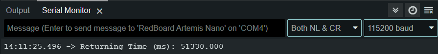
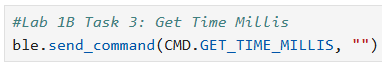

* **Notification Handler**
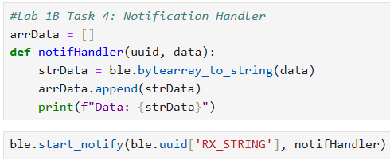

* **Loop of Current Time**

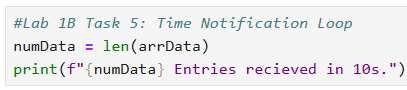

* **Array of Time Stamps**
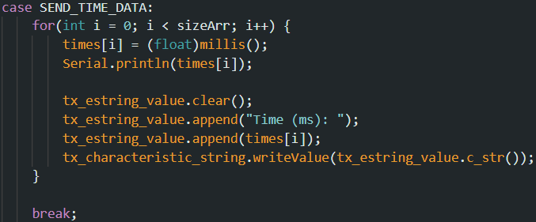
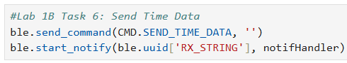

* **Temperature Readings at Each Time Stamp**
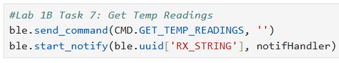

* **Differences Between Methods**

## 3. Discussion
In this lab, I became familiar with using the sensors of the RedBoard Artemis Nano and receiving data using each of its sensors. The platform is not very intuitive, but with instruction, I seem to have properly configured the board without very many challenges. To complete this lab, I also referenced Nila Narayan's & Mikayla Lahr's websites from the 2024 offering of this course to speed up debugging my code.
