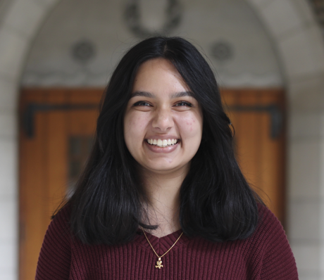

# Vidhi Srivastava - Fast Robots SP2025
## About Me

My name is Vidhi Srivastava, and I am currently a senior at Cornell University. I am majoring in Electrical and Computer Engineering and minoring in Robotics and Law & Society, and outside of my classes, I am an ECE Subteam Lead on Cornell Cup Robotics, an Outreach Coordinator of SWE, and a contemporary art/culture enthusiast. My professional interests in engineering include many industries such as power & transportation infrastructure, sustainable energy, social justice, medical devices & assistive robots, agriculture, art & film, and aerospace research.

# Lab Reports
### [Lab 1](./LabOne.md)
### [Lab 2](./LabTwo.md)
### [Lab 3](./LabThree.md)
